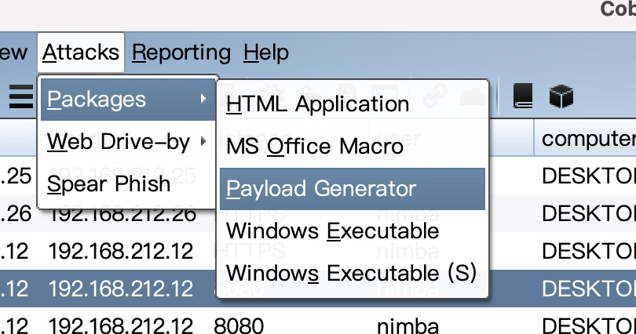
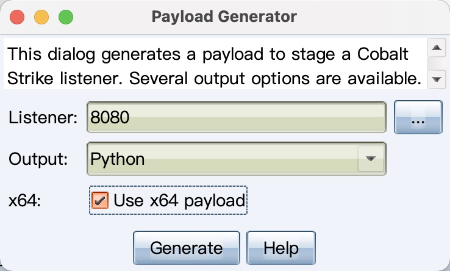
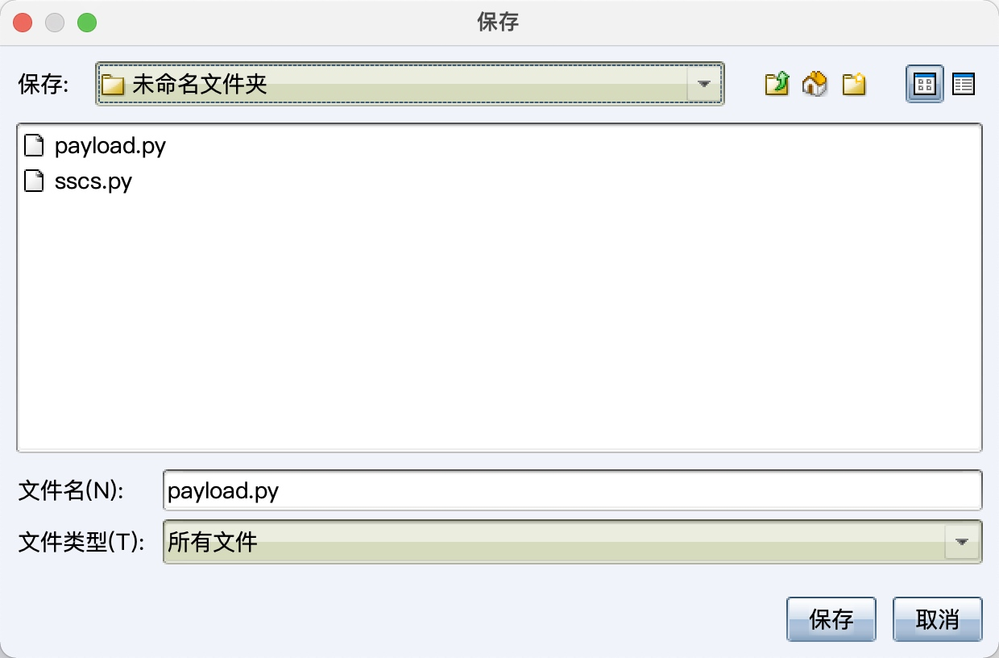
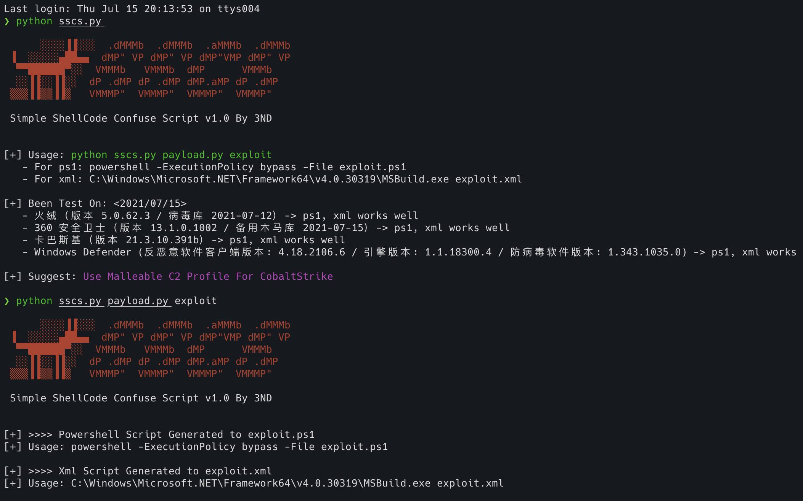
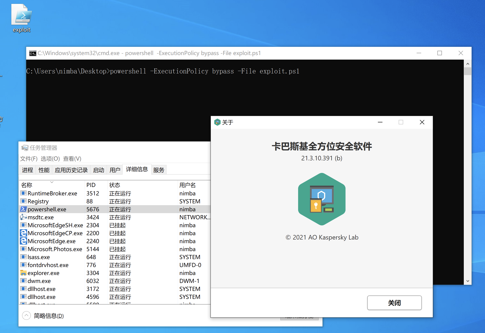
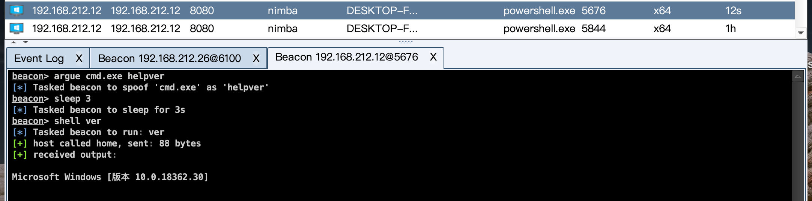
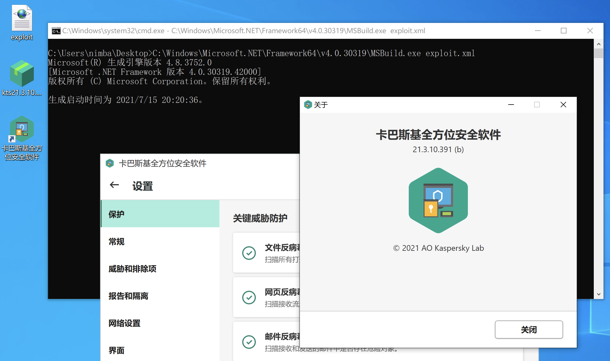
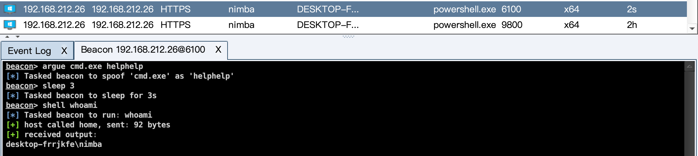

# Simple ShellCode Obfuscation Script

```
🐨 ››› python ssos.py

      ░░░░▐▐░░░  .dMMMb  .dMMMb  .aMMMb  .dMMMb
 ▐  ░░░░░▄██▄▄  dMP" VP dMP" VP dMP"dMP dMP" VP
  ▀▀██████▀░░   VMMMb   VMMMb  dMP dMP  VMMMb
  ░░▐▐░░▐▐░░  dP .dMP dP .dMP dMP.aMP dP .dMP
 ▒▒▒▐▐▒▒▐▐▒   VMMMP"  VMMMP"  VMMMP"  VMMMP"

 Simple ShellCode Obfuscation Script v1.0
 https://github.com/inspiringz/python-toys @3ND

[+] Usage: python sscs.py payload.py output_filename
   - For ps1: powershell -ExecutionPolicy bypass -File exploit.ps1
   - For xml: C:\Windows\Microsoft.NET\Framework64\v4.0.30319\MSBuild.exe exploit.xml

[+] Been Test On: <2021/07/15>
   - 火绒（版本 5.0.62.3 / 病毒库 2021-07-12）-> ps1, xml works well
   - 360（版本 13.1.0.1002 / 备用木马库 2021-07-15）-> ps1, xml works well
   - 卡巴斯基（版本 21.3.10.391b）-> ps1, xml works well
   - Defender (客户端版本: 4.18.2106.6 / 引擎版本: 1.1.18300.4 / 防病毒软件版本: 1.343.1035.0) -> ps1, xml works

[+] Suggest: Use Malleable C2 Profile For CobaltStrike
```

## Usage

Step 1:








Step 2:


```
❯ python sscs.py payload.py exploit

      ░░░░▐▐░░░  .dMMMb  .dMMMb  .aMMMb  .dMMMb
 ▐  ░░░░░▄██▄▄  dMP" VP dMP" VP dMP"VMP dMP" VP
  ▀▀██████▀░░  VMMMb   VMMMb  dMP      VMMMb
  ░░▐▐░░▐▐░░  dP .dMP dP .dMP dMP.aMP dP .dMP
 ▒▒▒▐▐▒▒▐▐▒   VMMMP"  VMMMP"  VMMMP"  VMMMP"

 Simple ShellCode Confuse Script v1.0 By 3ND


[+] >>>> Powershell Script Generated to exploit.ps1
[+] Usage: powershell -ExecutionPolicy bypass -File exploit.ps1

[+] >>>> Xml Script Generated to exploit.xml
[+] Usage: C:\Windows\Microsoft.NET\Framework64\v4.0.30319\MSBuild.exe exploit.xml
```




Step 3:

ps1:

```bash
powershell -ExecutionPolicy bypass -File exploit.ps1
```






or xml:

```bash
C:\Windows\Microsoft.NET\Framework64\v4.0.30319\MSBuild.exe exploit.xml
```




