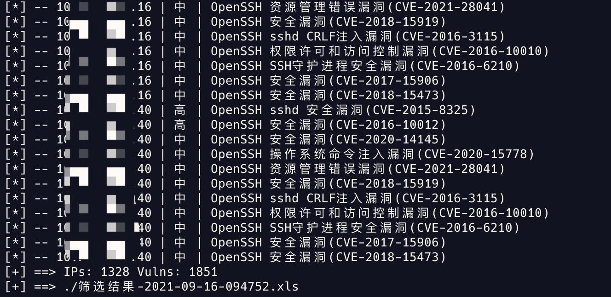
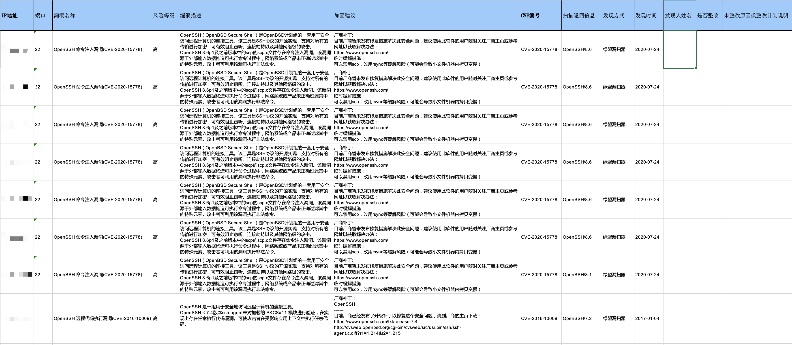

# Python-Toys

> Toys written in python 🐍

1. SSOS - Simple Shellcode Obfuscation Script

简单的 Cobalt Strike Shellcode 免杀混淆脚本（Shellcode => ps1, xml）

2. NVC - NSFOCUS Venustech Clean

绿盟、启明星辰漏扫结果清洗脚本，根据漏洞名称、漏洞描述、风险等级等筛选结果。

生成筛选结果后，Excel 对齐方式选择自动换行、调整列宽、自动调整行高即可：

